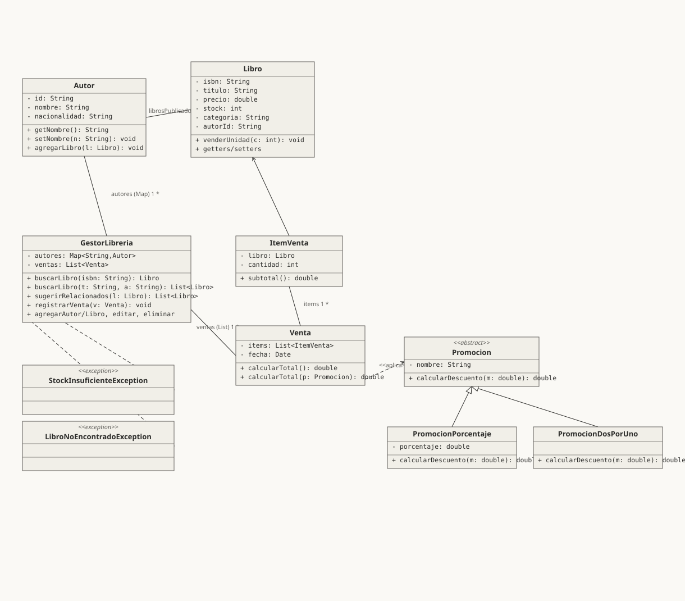

# 📚 Gestión de Ventas en una Librería

Sistema de gestión de una librería desarrollado en **Java** para la asignatura **ICI2241 - Programación Avanzada**.

El proyecto permite administrar autores, libros y ventas, incorporando control de stock, promociones, búsqueda de libros y persistencia de información mediante archivos CSV. El sistema puede utilizarse mediante una **interfaz de consola** o una **interfaz gráfica de ventana**.

---

## 📋 Descripción

El sistema busca representar el funcionamiento básico de una librería, permitiendo gestionar su catálogo de libros y registrar las ventas realizadas.

La aplicación mantiene información sobre:

- Autores
- Libros
- Ventas
- Stock disponible
- Promociones

Además, cuenta con mecanismos para validar operaciones y evitar ventas cuando no existe stock suficiente.

---

## Funcionalidades

###  Gestión de autores

El sistema permite:

- Registrar autores.
- Listar autores.
- Buscar autores.
- Editar información de autores.
- Eliminar autores.
- Asociar libros a un autor.

Cada autor se identifica mediante un ID único.

### Gestión de libros

Se pueden realizar las siguientes operaciones:

- Registrar libros.
- Listar libros.
- Buscar libros mediante ISBN.
- Buscar libros mediante título y autor.
- Editar información de libros.
- Eliminar libros.
- Consultar libros relacionados según su género.
- Modificar precio y stock.

La búsqueda por título y autor permite realizar coincidencias parciales y considera diferencias de tildes.

### Gestión de ventas

El sistema permite:

- Registrar ventas.
- Agregar múltiples libros a una misma venta.
- Consultar ventas registradas.
- Buscar una venta.
- Editar la fecha de una venta.
- Eliminar una venta.
- Generar automáticamente el identificador de cada venta.
- Descontar automáticamente el stock correspondiente.

Antes de registrar una venta, el sistema verifica que las cantidades solicitadas sean válidas y que exista stock suficiente.

### Promociones

Las ventas pueden incorporar promociones, entre ellas:

- Sin promoción.
- Descuento porcentual.
- Promoción 2x1.

El sistema calcula el total de la venta considerando la promoción seleccionada.

### Persistencia de datos

La información puede almacenarse y recuperarse mediante archivos **CSV**.

El sistema verifica si existen datos guardados al iniciar. Si existen, los carga automáticamente; de lo contrario, utiliza datos iniciales de prueba para permitir la ejecución inmediata del programa.

Los archivos CSV incluidos en el proyecto corresponden a:

- `autores.csv`
- `libros.csv`
- `ventas.csv`

---

## Modos de uso

El programa dispone de dos formas de interacción:

### Consola

Permite utilizar el sistema mediante un menú de opciones en la terminal.

Incluye las operaciones de gestión de autores, libros y ventas.

### 🪟 Interfaz gráfica

También es posible utilizar el sistema mediante una interfaz gráfica implementada en Java.

Al iniciar el programa se puede seleccionar:

```text
¿Como deseas usar el sistema?

1. Consola
2. Ventana
```

La opción `2` inicia la interfaz gráfica, mientras que cualquier otra opción permite acceder al modo consola.

---

## Tecnologías utilizadas

| Tecnología | Uso |
|---|---|
| Java | Lenguaje principal |
| Java Swing | Interfaz gráfica |
| CSV | Persistencia de datos |
| Java Collections | Gestión de autores y ventas |
| Programación Orientada a Objetos | Modelado del sistema |
| Excepciones | Control de errores y reglas de negocio |

El proyecto utiliza estructuras como `Map`, `List` y `ArrayList` para administrar los objetos del sistema.

---

## Estructura del proyecto

```text
PROYECTO-ICI2241---GESTION-DE-VENTAS-EN-UNA-LIBRERIA/
│
├── ProyectoGestion/
│   ├── src/
│   │   ├── Autor.java
│   │   ├── GestorArchivosCSV.java
│   │   ├── GestorLibreria.java
│   │   ├── InterfazConsola.java
│   │   ├── InterfazVentana.java
│   │   ├── ItemVenta.java
│   │   ├── Libro.java
│   │   ├── LibroNoEncontradoException.java
│   │   ├── Main.java
│   │   ├── Promocion.java
│   │   ├── PromocionDosPorUno.java
│   │   ├── PromocionPorcentaje.java
│   │   ├── StockInsuficienteException.java
│   │   └── Venta.java
│   │
│   ├── autores.csv
│   ├── libros.csv
│   └── ventas.csv
│
├── uml_libreria_2.svg
├── .classpath
├── .project
├── .gitignore
└── README.md
```

La estructura del código separa las entidades principales, la lógica de gestión, las interfaces de usuario, las excepciones y la persistencia de datos.

---

## Principales clases

### `GestorLibreria`

Es la clase encargada de centralizar la lógica principal del sistema.

Entre sus responsabilidades se encuentran:

- Gestionar autores.
- Gestionar libros.
- Registrar y administrar ventas.
- Buscar libros y ventas.
- Validar stock.
- Aplicar promociones.
- Generar identificadores de ventas.

Las ventas utilizan un identificador compuesto por un correlativo y la fecha de la venta.

### `GestorArchivosCSV`

Se encarga de guardar y cargar la información del sistema utilizando archivos CSV.

### `InterfazConsola`

Implementa la interacción del usuario mediante la terminal.

### `InterfazVentana`

Implementa la interacción mediante una interfaz gráfica.

### `Promocion`

Define la estructura utilizada para aplicar promociones a las ventas.

Cuenta con implementaciones como:

- `PromocionDosPorUno`
- `PromocionPorcentaje`

### Excepciones

El proyecto incorpora excepciones propias para controlar situaciones como:

- `LibroNoEncontradoException`
- `StockInsuficienteException`

---

## Flujo básico de una venta

El registro de una venta sigue, a grandes rasgos, el siguiente flujo:

```text
Inicio
  │
  ▼
Seleccionar libro mediante ISBN
  │
  ▼
Ingresar cantidad
  │
  ▼
¿Agregar otro libro?
  │
  ├── Sí ──────► Agregar otro libro
  │
  └── No
        │
        ▼
Seleccionar promoción
        │
        ▼
Validar stock
        │
        ├── Stock insuficiente
        │       │
        │       ▼
        │     Error
        │
        └── Stock suficiente
                │
                ▼
          Registrar venta
                │
                ▼
          Descontar stock
                │
                ▼
              Fin
```

La validación del stock se realiza antes de modificar las cantidades disponibles, evitando registrar parcialmente una venta inválida.

---

## Ejecución

### Requisitos

Para ejecutar el proyecto se necesita:

- **Java JDK** instalado.
- Un IDE compatible con proyectos Java, como **Eclipse**, o un entorno que permita compilar y ejecutar archivos `.java`.

### Desde Eclipse

1. Clonar el repositorio:

```bash
git clone https://github.com/sebastivnvvv/PROYECTO-ICI2241---GESTION-DE-VENTAS-EN-UNA-LIBRERIA.git
```

2. Importar `ProyectoGestion` como proyecto Java en Eclipse.
3. Verificar que el JDK esté correctamente configurado.
4. Ejecutar:

```text
Main.java
```

5. Seleccionar el modo de uso:

```text
1. Consola
2. Ventana
```

El programa carga automáticamente los datos almacenados en CSV cuando estos existen. Si no existen datos guardados, se cargan datos iniciales de prueba.

---

## Diagrama UML

El proyecto incluye un diagrama UML que representa la estructura del sistema:


